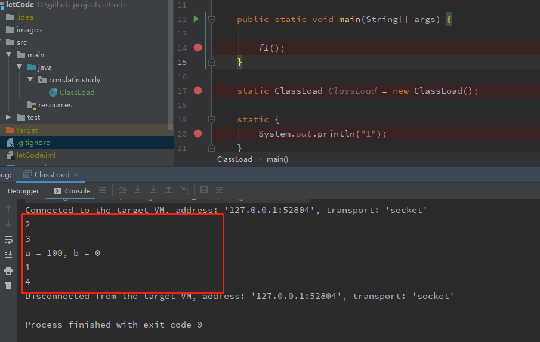

# letCode
java code 


## 图示
### ClassLoad.java
```java
package com.latin.study;

/**
 * @author: util.you.com@gmail.com
 * @date: 2019/9/16 13:35
 * @description: 分析类的实例化过程
 * @version: 1.0
 * @className: ClassLoad
 */
public class ClassLoad {

    public static void main(String[] args) {

        f1();
    }

    static ClassLoad ClassLoad = new ClassLoad();

    static {
        System.out.println("1");
    }

    {
        System.out.println("2");
    }

    ClassLoad(){
        System.out.println("3");
        System.out.println("a = " + a + ", b = " + b);
    }

    public static void f1(){

        System.out.println("4");
    }

    int a = 100;
    static int b = 200;
}

```

#### 结果
<details>
  <summary>展开ClassLoad的运行结果</summary>
  
</details>

